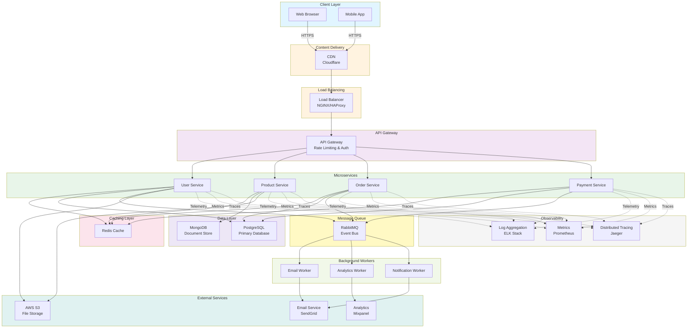

# System Architecture Overview

## Architecture Diagram

## Architecture Components

### Client Layer
- **Web Browser**: Desktop web application accessed through HTTPS
- **Mobile App**: Native or cross-platform mobile application

### Content Delivery
- **CDN (Cloudflare)**: Global content delivery network for static assets and edge caching

### Load Balancing & Gateway
- **Load Balancer**: Distributes incoming traffic across multiple API Gateway instances
- **API Gateway**: Handles authentication, rate limiting, and request routing

### Microservices
- **User Service**: Manages user accounts, authentication, and profiles
- **Product Service**: Handles product catalog and inventory
- **Order Service**: Processes orders and order management
- **Payment Service**: Manages payment processing and transactions

### Caching Layer
- **Redis**: In-memory cache for frequently accessed data, improving response times

### Data Layer
- **PostgreSQL**: Relational database for transactional data (users, orders, payments)
- **MongoDB**: NoSQL database for document-based data (products, user preferences)

### Message Queue
- **RabbitMQ**: Asynchronous event bus for inter-service communication

### Background Workers
- **Email Worker**: Sends transactional and marketing emails
- **Analytics Worker**: Processes analytics events and generates insights
- **Notification Worker**: Sends push notifications and alerts

### External Services
- **AWS S3**: Cloud storage for user uploads and static files
- **SendGrid**: Email delivery service
- **Mixpanel**: Analytics and tracking platform

### Observability
- **ELK Stack**: Centralized logging for debugging and monitoring
- **Prometheus**: Metrics collection and monitoring
- **Jaeger**: Distributed tracing for request flow analysis

## Communication Patterns

- **Solid Lines**: Synchronous HTTP/REST communication
- **Dotted Lines**: Asynchronous telemetry and monitoring

## Deployment Configuration

### Containerization
- All services are containerized using Docker
- Container images are stored in private Docker registry (AWS ECR)
- Multi-stage builds for optimized image sizes

### Orchestration
- Kubernetes (EKS) for container orchestration
- Helm charts for deployment automation
- Namespace segregation: `production`, `staging`, `development`

### Infrastructure Stack
- **Compute**: Kubernetes nodes with auto-scaling groups
- **Networking**: VPC with private and public subnets
- **Database**: RDS for PostgreSQL, DocumentDB for MongoDB
- **Cache**: ElastiCache for Redis cluster
- **Message Queue**: Managed RabbitMQ or Amazon MQ
- **Storage**: S3 with CloudFront for static assets

### Environment Configuration
- Environment variables managed via ConfigMaps
- Secrets stored in AWS Secrets Manager
- `.env` files for local development

## Scaling Strategy

### Horizontal Scaling
- Services can scale independently based on demand
- Kubernetes HPA (Horizontal Pod Autoscaler) adjusts pod count
- Target metrics: CPU utilization (70%), memory (80%), custom metrics

### Vertical Scaling
- Node instance types can be upgraded for increased capacity
- Database read replicas for distributed query load
- Connection pooling for database efficiency

### Database Scaling
- Database sharding for large datasets across multiple instances
- Read replicas for query distribution
- Regular backup and recovery procedures
- Archive old data to S3 for cost optimization

### Cache Optimization
- Cache warming: pre-load critical data during deployment
- TTL strategy: short TTL for volatile data, longer for stable data
- Cache invalidation: event-driven updates for consistency

## Security Architecture

### Network Security
- **VPC**: Isolated network environment with security groups
- **WAF**: AWS WAF for protection against common attacks
- **TLS/SSL**: All external communication encrypted with TLS 1.2+
- **mTLS**: Service-to-service communication with mutual TLS

### Authentication & Authorization
- OAuth 2.0 / OpenID Connect for user authentication
- JWT tokens with expiration and refresh mechanisms
- Role-Based Access Control (RBAC) for service authorization
- API key management for external integrations

### Data Protection
- Encryption at rest: AES-256 for sensitive data
- Encryption in transit: TLS for all data movement
- Database encryption: transparent data encryption (TDE)
- PII masking in logs and monitoring systems

### Secrets Management
- AWS Secrets Manager for credential rotation
- HashiCorp Vault integration for advanced scenarios
- Encrypted environment variables in CI/CD pipeline
- Regular audit logs for secret access

### Compliance & Audit
- GDPR compliance: data retention and deletion policies
- PCI-DSS compliance for payment processing
- Audit logging for all critical operations
- Regular security assessments and penetration testing

## Monitoring & Observability

### Metrics Collection
- Prometheus scrapes metrics from service endpoints
- Custom metrics for business logic monitoring
- Grafana dashboards for visualization
- Alert thresholds for anomaly detection

### Logging Strategy
- ELK Stack (Elasticsearch, Logstash, Kibana)
- Centralized log aggregation from all services
- JSON logging format for structured analysis
- Log retention: 30 days hot storage, 1 year archive

### Distributed Tracing
- Jaeger for request tracing across services
- Correlation IDs for request tracking
- Performance profiling and bottleneck identification
- Service dependency mapping

### Alerting
- PagerDuty integration for critical alerts
- Slack notifications for informational alerts
- Escalation policies for on-call management
- Alert aggregation and deduplication

## Disaster Recovery

### Backup Strategy
- Database backups: daily snapshots with point-in-time recovery
- Application data: S3 cross-region replication
- Configuration backups: version-controlled infrastructure as code

### High Availability
- Multi-AZ deployment across availability zones
- Database failover: automatic promotion of read replicas
- Load balancer health checks for instance monitoring
- Circuit breakers and retry logic in services

### RTO & RPO Goals
- **RTO** (Recovery Time Objective): 1 hour for complete service restoration
- **RPO** (Recovery Point Objective): 5 minutes maximum data loss
- Regular disaster recovery drills quarterly

### Failover Procedures
1. Automatic detection of service failures via health checks
2. Immediate rerouting of traffic to healthy instances
3. Database failover to standby replicas
4. Manual intervention for complex failure scenarios

## Performance Optimization

### Caching Strategy
- Application-level caching with Redis
- Database query result caching
- HTTP caching headers for CDN optimization
- Cache busting on data updates

### Database Optimization
- Query indexing on frequently accessed columns
- Query optimization with EXPLAIN analysis
- Connection pooling (PgBouncer for PostgreSQL)
- Regular VACUUM and ANALYZE operations

### API Performance
- Response compression (gzip, brotli)
- Pagination for large result sets
- Partial response filtering (sparse fieldsets)
- Rate limiting to prevent abuse

### Frontend Optimization
- Code splitting and lazy loading
- Asset minification and compression
- Image optimization and CDN delivery
- Service worker for offline capability

## Development Workflow

### Version Control
- Git-based workflow with feature branches
- Conventional commits for consistent history
- Semantic versioning for releases

### CI/CD Pipeline
- GitHub Actions for automated testing
- DockerHub/ECR for image registry
- Automated deployment to staging on PR
- Manual approval for production deployments

### Code Quality
- SonarQube for code analysis
- ESLint/Prettier for code formatting
- Unit tests: >80% coverage target
- Integration tests for service communication

### Documentation
- API documentation with OpenAPI/Swagger
- Architecture Decision Records (ADRs)
- Runbook documentation for operations
- README files in each service directory

## Technology Stack Summary

| Layer | Technology | Version |
|-------|-----------|---------|
| **Frontend** | React/Vue | Latest LTS |
| **API Gateway** | NGINX/Kong | Latest Stable |
| **Services** | Node.js/Python/Go | Latest LTS |
| **Cache** | Redis | 7.x |
| **Primary DB** | PostgreSQL | 14+ |
| **Document DB** | MongoDB | 5.x |
| **Message Queue** | RabbitMQ | 3.x |
| **Orchestration** | Kubernetes | 1.24+ |
| **Logging** | ELK Stack | 8.x |
| **Monitoring** | Prometheus/Grafana | Latest |
| **Tracing** | Jaeger | Latest |

## Future Roadmap

- [ ] Implement GraphQL API layer for flexible querying
- [ ] Add GraphQL subscription support for real-time updates
- [ ] Migrate to service mesh (Istio/Linkerd) for advanced traffic management
- [ ] Implement event sourcing for audit trails
- [ ] Add machine learning pipeline for recommendations
- [ ] Implement feature flags for gradual rollouts
- [ ] Setup multi-region deployment for global redundancy
- [ ] Implement CQRS pattern for read/write separation

## Contact & Support

For questions or updates to this architecture:
- **Architecture Review**: architecture-review@company.com
- **DevOps Support**: devops@company.com
- **Security Concerns**: security@company.com
